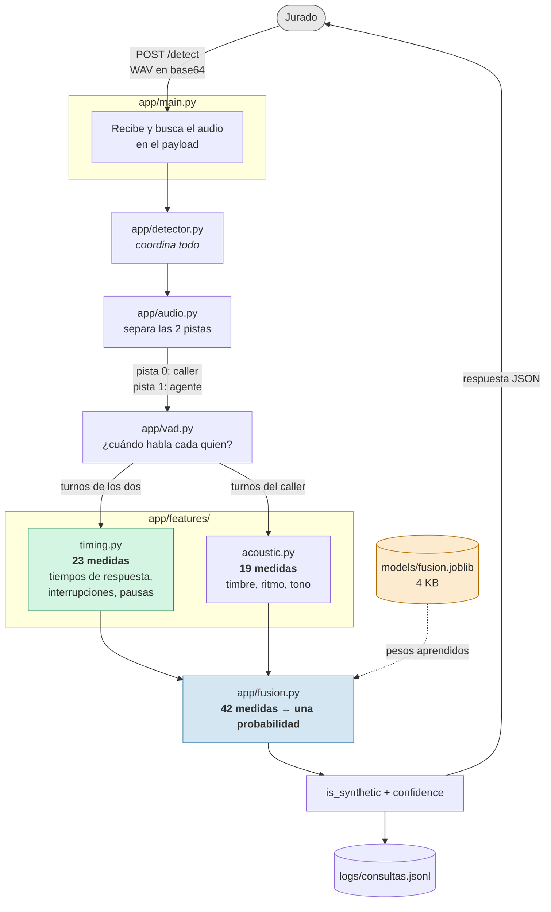
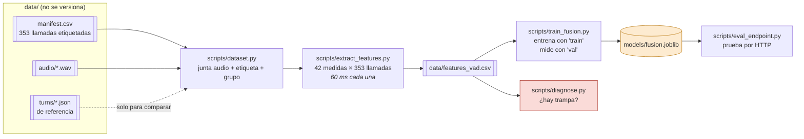
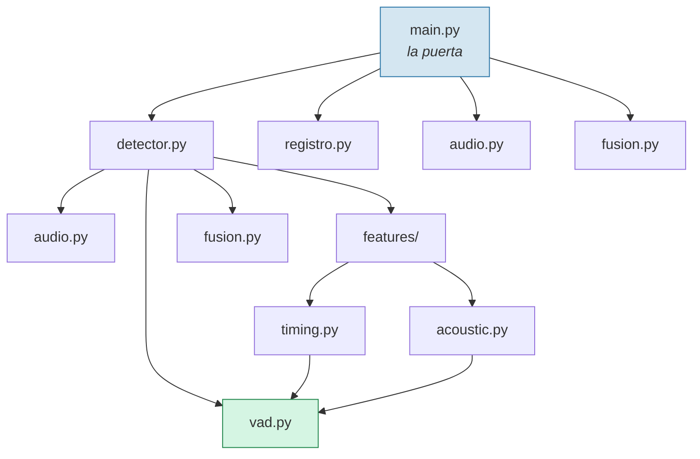

# Arquitectura

Dos mundos separados, y conviene no confundirlos:

- **En vivo** — lo que pasa cada vez que llega una llamada. Corre en 200 ms.
- **De antemano** — el entrenamiento. Se hace una vez y deja un archivo de 4 KB.

---

## 1. El recorrido de una llamada (en vivo)



**Lo importante del diagrama:** `vad.py` alimenta a los dos bloques de medidas,
pero `timing.py` necesita los turnos de **ambas** pistas y `acoustic.py` solo los
del caller. Esa diferencia es la idea central del proyecto: sin el canal del
agente, "respondió en 900 ms" no significa nada.

---

## 2. El entrenamiento (de antemano, una sola vez)



`diagnose.py` no produce nada que el programa use: produce **evidencia**. Es el
que contesta "¿aprende la voz o aprende el canal?" cuando el jurado pregunte.

---

## 3. Quién depende de quién



`vad.py` y `audio.py` **no dependen de nada interno**. Eso es a propósito: son
las piezas de abajo y se pueden probar solas. Si mañana cambian el detector de
voz por silero, nada más se toca ese archivo.

---

## 4. La cascada (pensada para la latencia)

La latencia es criterio de calificación, así que el sistema está diseñado para
no gastar tiempo cuando no hace falta.

```
  Llamada
     │
     ▼
  ┌─────────────────────────────────────┐
  │ NIVEL 1  ·  ~200 ms  ·  siempre     │   ← implementado
  │ turnos + timing + acústica barata   │
  └─────────────────────────────────────┘
     │
     ├── ¿seguro?  ──── sí ──►  responder
     │
     ▼ no (zona gris)
  ┌─────────────────────────────────────┐
  │ NIVEL 2  ·  ~2 s   ·  solo si dudó  │   ← pendiente (encargo 2)
  │ modelo acústico pesado              │
  └─────────────────────────────────────┘
     │
     ▼ sigue dudando
  ┌─────────────────────────────────────┐
  │ NIVEL 3  ·  ~10 s  ·  casi nunca    │   ← pendiente (encargo 1)
  │ transcribir y buscar respuestas     │
  │ inventadas                          │
  └─────────────────────────────────────┘
```

Hoy **casi todas las llamadas se resuelven en el nivel 1**. El andamiaje de los
otros dos ya está puesto en `detector.py`.

---

## 5. Las puertas del servicio

| Puerta | Quién la usa | Para qué |
|---|---|---|
| `POST /detect` | El jurado, automático | **La que califica.** Recibe el WAV, devuelve el veredicto |
| `GET /stats` | Ustedes, durante el judging | ¿Ya empezaron? ¿cuántas llevan? ¿truena algo? |
| `GET /health` | Ustedes y el túnel | ¿Está vivo? ¿tiene modelo cargado? |
| `POST /detect/upload` | Ustedes, a mano | Subir un archivo para probar |

---

## Tres decisiones que se ven en los diagramas

**El modelo es un archivo, no código.** `fusion.joblib` pesa 4 KB y se versiona.
Por eso el servicio arranca recién clonado sin necesitar los 671 MB de audio.

**El audio nunca se guarda.** `registro.py` anota cuándo llegó, cuánto pesaba y
qué respondimos — nunca el contenido. Son voces de personas reales.

**Entrenamos con lo mismo que servimos.** El dataset trae turnos de referencia
mejores que los nuestros, pero el jurado solo manda el WAV. Si entrenáramos con
la referencia, habría un desajuste invisible entre la prueba y la realidad. Por
eso `turns/` aparece punteado en el diagrama: se usa para comparar, no para
entrenar el modelo que se sirve.
